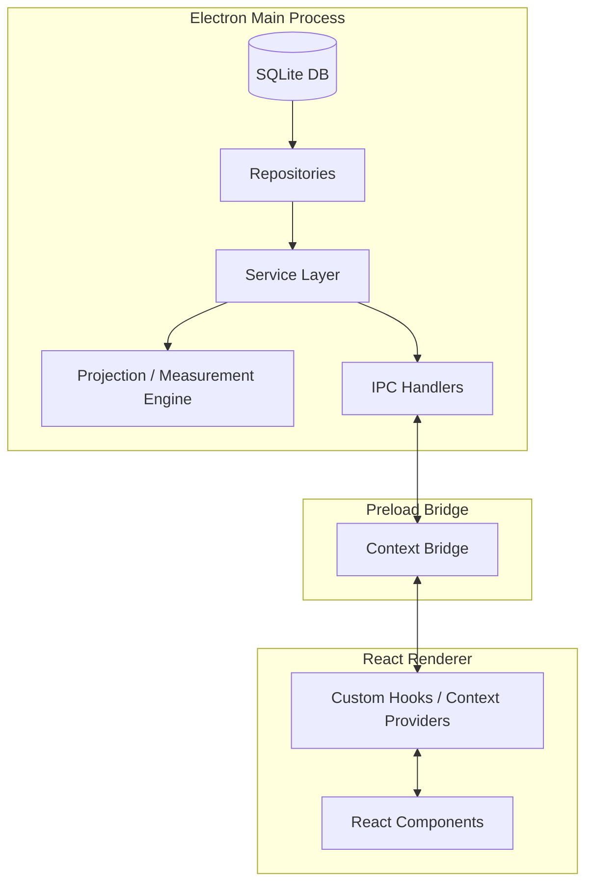

# GeoTerrain Analyzer

GeoTerrain Analyzer is a commercial-grade, fully offline desktop GIS application built for land surveyors, geographers, and civil engineers. It provides a robust suite of tools to create and manage land boundary coordinate vertices, construct valid GIS polygons, perform accurate surface area and perimeter calculations, import/export spatial datasets, and generate professional PDF analysis reports.

---

## 🚀 Key Features

* **Project Management**: Group survey boundaries into projects. Supports search, sort-by-recency, autosave triggers, and cascading deletions.
* **Coordinate Vertex Control**: Enter, edit, and reorder GPS coordinates. Features a complete local transactional Undo/Redo stack.
* **GIS Validation Engine**: Real-time validation checks for coordinate ranges, point density, self-intersection (bowtie boundaries), and closed-ring geometry.
* **Calculation Engine**:
  * Calculates boundary surface area in **Square Meters**, **Square Kilometers**, **Hectares**, and **Acres**.
  * Measures boundary perimeter in **Meters** and **Kilometers**.
  * Locates the geometric **Centroid** (lat/lon) and **Bounding Box** limits.
* **Projection Engine**: Projects decimal degree coordinates (EPSG:4326 Datum) to local UTM space (Universal Transverse Mercator) to ensure Euclidean calculation accuracy.
* **Data Exchange Engine**: Import and export GIS data via:
  * **GeoJSON** Polygons
  * **CSV** Coordinate Lists
  * **JSON** GeoTerrain Project Archive
* **PDF Report Generator**: Generates professional, multi-page print-ready PDF reports with SVG boundary visualizations, centroid metrics, and coordinate tables.
* **Visual Controls**: Dark, Light, and System themes; grid overlay; vertex labels; and north indicator target.

---

## 🛠️ Tech Stack

* **Shell Runtime**: Electron
* **Frontend**: React (18), TailwindCSS, TypeScript
* **Database**: SQLite (via `better-sqlite3`)
* **GIS Utilities**: Turf.js (geospatial operations), Proj4 (coordinate projections)
* **Report Utility**: jsPDF (PDF document generation)
* **Build System**: Vite (Renderer), tsc (Main process)

---

## 📐 System Architecture

The application adopts clean architecture principles, separating the system into a backend service layer and a reactive user interface:



### Folder Structure
* `electron/` — Electron Main Process
  * `database/` — Connection health-check and SQL migrations schema
  * `ipc/` — Strongly-typed IPC main handlers
  * `repositories/` — SQLite database access layer (Projects, Coordinates, Results, Settings)
  * `services/` — Business logic (Geometry validation, Projection scaling, Measurements)
  * `utils/` — Engines (Import, Export, Projection, Measurement, PDF Reporting)
* `src/` — React Renderer Process
  * `components/` — Modals, settings dialog, map canvases, tables, and buttons
  * `context/` — State providers for projects, coordinates, measurements, theme settings, and import/export operations
  * `hooks/` — Custom React hooks wrapping the application context
  * `styles/` — Global styling and custom Tailwind tokens

---

## 📦 Installation & Setup

### Prerequisites
* [Node.js](https://nodejs.org/) (v18 or higher recommended)
* NPM (comes packaged with Node.js)

### Installation
1. Clone the repository:
   ```bash
   git clone https://github.com/deoxyforge/GeoTerrain.git
   cd GeoTerrain
   ```
2. Install dependencies:
   ```bash
   npm install
   ```
3. If SQLite native binaries fail to load on your platform, rebuild them for Electron:
   ```bash
   npm run rebuild:sqlite
   ```

---

## 🛠️ Development

To start the Vite dev server and launch the Electron application in development mode:
```bash
npm run dev
```

The linter and TypeScript compiler check can be run using:
```bash
npm run lint
npm run build:electron
```

---

## 🔨 Packaging and Distribution

To build, compile, and package the production binaries:
```bash
npm run build
```

This will compile the renderer and main process scripts and invoke `electron-builder` to generate target distributions in the `release/` directory:
* **`GeoTerrain Analyzer Setup 1.0.0.exe`**: Standard Windows installer (NSIS)
* **`GeoTerrain Analyzer 1.0.0.exe`**: Standalone portable Windows executable

---

## 📖 Usage Guide

1. **Create Project**: Click the `+` button in the sidebar and assign a name and description to your project.
2. **Add Coordinates**: Click the `+ Add Coordinate` button in the toolbar. Enter your vertex locations in Decimal Degrees (WGS84). At least 3 points are required.
3. **Analyze Boundary**: Once you have entered 3 or more points and the real-time validator displays `✓ Valid Boundary Polygon`, click `Analyze Polygon` to calculate centroid, perimeter, bounding limits, and areas.
4. **Generate PDF**: Click `Generate Report` to preview and print a PDF format survey document.
5. **Import/Export**: Use the dropdown menus to load coordinates from CSV or export project boundaries to GeoJSON.

---

## 🔮 Future Roadmap (v1.1)

* **Coordinate System Upgrades**: Support Degrees Minutes Seconds (DMS) and Degrees Decimal Minutes (DDM) input with auto-detection.
* **Map Controls**: Centroid centering, boundary bounds fitting, and interactive vertex drag-and-drop.
* **Productivity Tools**: Excel/Spreadsheet copy-paste coordinates buffer parsing, bulk coordinates csv import.
* **Layout Enhancements**: Collapsible and resizable sidebars, custom layout state persistence, and full-screen focus modes.

---

## 📄 License

This project is licensed under the MIT License. See the [LICENSE](LICENSE) file for details.
