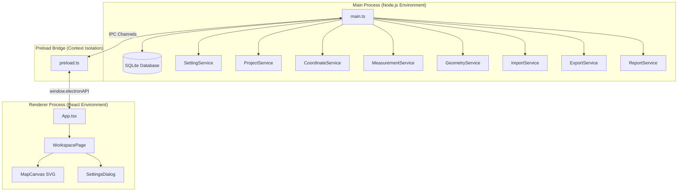
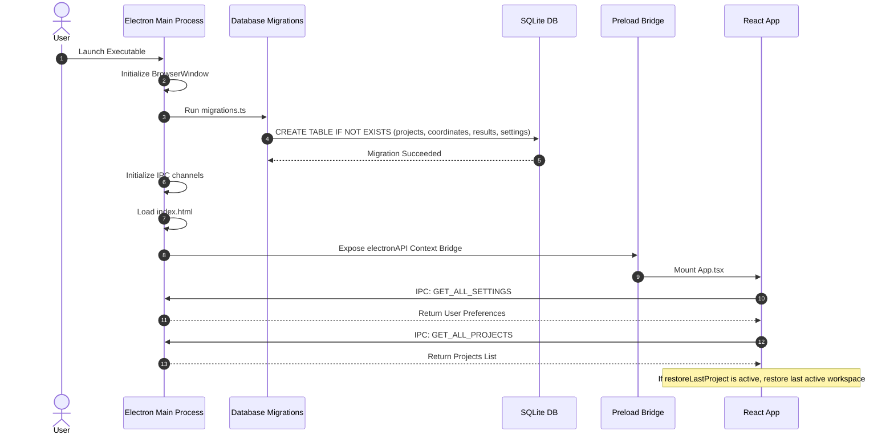
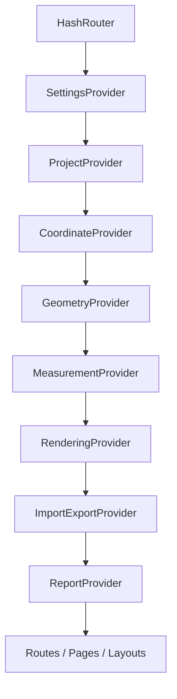
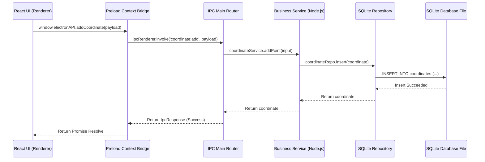

# Architecture & Process Walkthrough

This document outlines the process architecture, initialization flow, context hierarchy, and folder structure of GeoTerrain Analyzer v1.0.0.

---

## 1. Electron Process Architecture

The application is built on top of Electron's multi-process architecture to enforce sandboxing and security.



---

## 2. Application Startup Sequence

When the user launches the application, the startup sequence executes as follows:



---

## 3. React Context Hierarchy

State is managed globally in the renderer process using the React Context API. The provider tree is structured as follows:



---

## 4. Folder Structure Tree

```
GeoTerrain/
├── assets/                  # App icon and build resources
├── docs/                    # Architectural and testing documentation
│   ├── testing/             # QA logs and test cases
│   └── walkthrough/         # System diagrams and flowcharts
├── electron/                # Main process codebase
│   ├── database/            # SQLite connection and migration queries
│   ├── ipc/                 # IPC communication handlers
│   ├── repositories/        # Database tables mapper classes
│   ├── services/            # Business logic wrappers
│   ├── utils/               # PDF rendering and file importers
│   ├── main.ts              # Electron entry script
│   └── preload.ts           # IPC bridge script
├── src/                     # React renderer process codebase
│   ├── components/          # Reusable UI components
│   ├── context/             # React providers
│   ├── hooks/               # Custom hooks
│   ├── layouts/             # Page structural layouts
│   ├── pages/               # Workspace pages
│   ├── styles/              # Global Tailwind style rules
│   ├── types/               # TypeScript interfaces
│   └── utils/               # Conversions and validation utils
├── package.json             # Build script targets and dependencies
├── vite.config.ts           # Bundler settings
└── tsconfig.json            # TypeScript compile configurations
```

---

## 5. IPC Communication Flow

IPC handlers act as communication channels between the UI and database.


