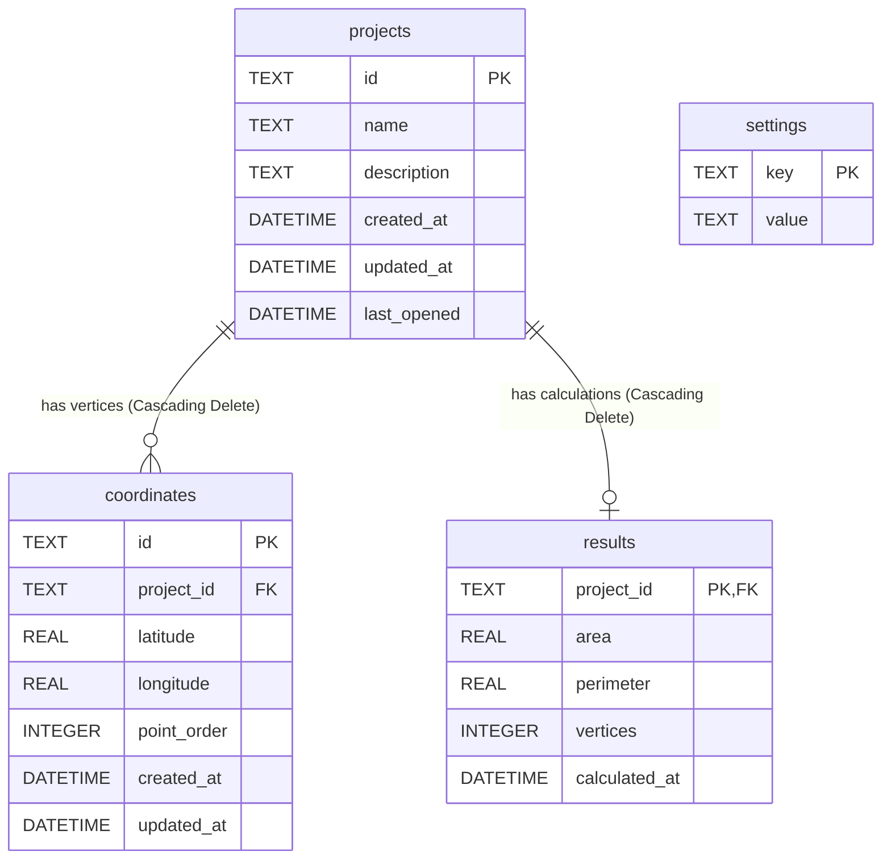

# Database & Features Walkthrough

This document outlines the database relationship schema and the complete feature map of GeoTerrain Analyzer v1.0.0.

---

## 1. Database Relationships

The database is built on top of SQLite to guarantee localized and lightweight storage without external dependencies.



---

## 2. Complete Feature Map

Here is the hierarchical map of modules and features of the GeoTerrain Analyzer:

```
GeoTerrain Analyzer v1.0.0
├── Project Management
│   ├── Create Project Workspace
│   ├── Edit Project Name & Description
│   ├── Delete Project Workspace (Cascading database clean)
│   ├── Search Sidebar (Dynamic string queries matching name/description)
│   └── Sorting Sidebar (Sort by Recent, Date Created, A-Z)
├── Coordinate Editor
│   ├── Add Coordinate Vertex (Forms validation check)
│   ├── Edit Vertex Coordinates
│   ├── Delete Vertex (Index healer healing order gaps)
│   ├── Swap Vertex Sequence Order (Move Up / Move Down)
│   ├── Undo State Manager (Ctrl + Z keys)
│   └── Redo State Manager (Ctrl + Y keys)
├── Validation Engine
│   ├── WGS84 Boundaries Check (Lat: -90..90, Lon: -180..180)
│   ├── Polygon Threshold Check (Minimum 3 points vertices count)
│   ├── Segment Self-Intersection Check (Highlight intersection lines in red)
│   └── Duplicate Nodes Check
├── Measurement Engine
│   ├── Centroid Calculation (Lat/Lon centroid tags)
│   ├── UTM Zone Projection (Datum conversions using Proj4)
│   ├── Polygon Area Metrics (Square Meters, Square Kilometers, Hectares, Acres)
│   └── Polygon Perimeter Metrics (Meters, Kilometers)
├── Rendering Visualizer
│   ├── Responsive SVG Canvas (ResizeObserver handles fit-bounds layout)
│   ├── Viewport Zoom & Pan (Click-drag & scroll support)
│   ├── Map Overlay grid pattern
│   ├── Vertex Index tag numbering
│   └── Vector North Indicator arrow symbol
├── Data Exchange
│   ├── Import Formats (Native Project JSON, CSV lists, GeoJSON Polygons)
│   └── Export Formats (Native Project JSON, CSV lists, GeoJSON Polygons)
└── Report Engine
    ├── Offline PDF Document Compiler (jsPDF)
    ├── PDF table styling grids
    └── Map Canvas base64 snapshot embeds
```
