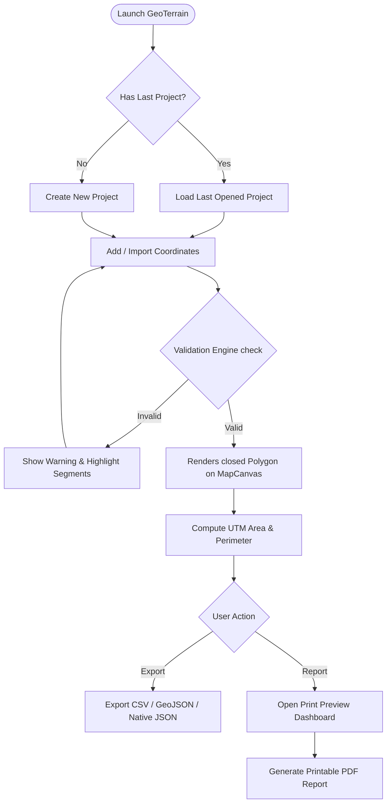
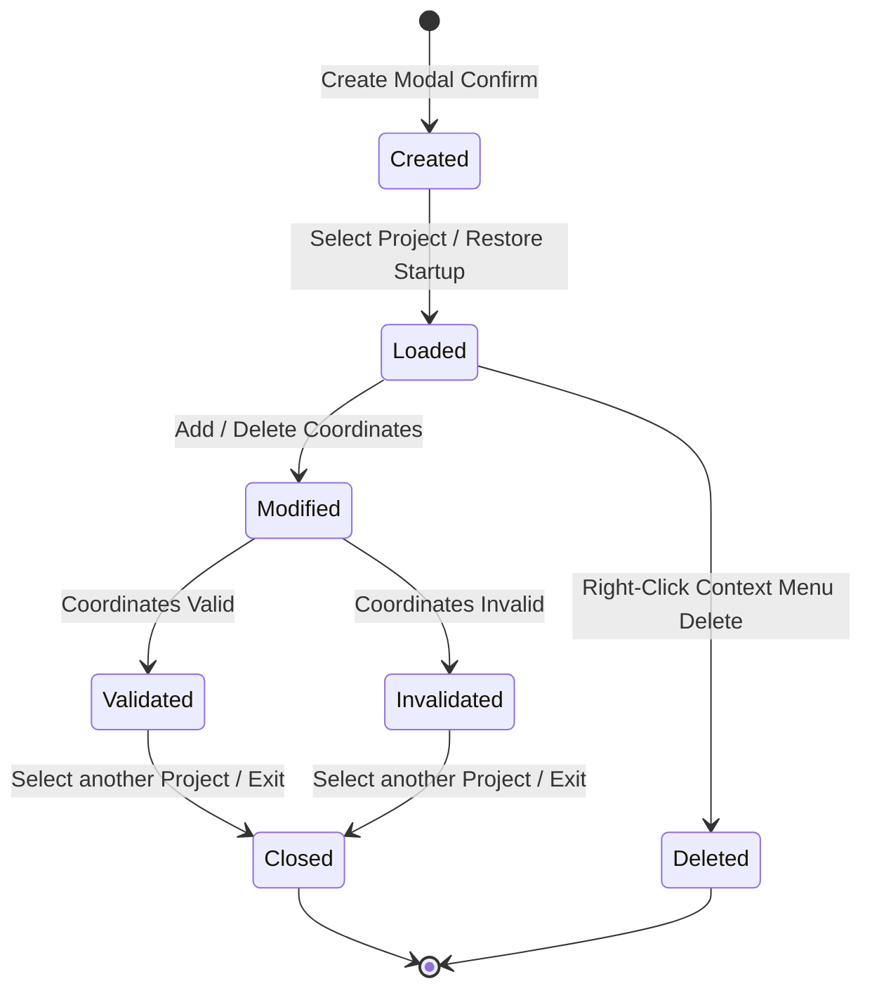
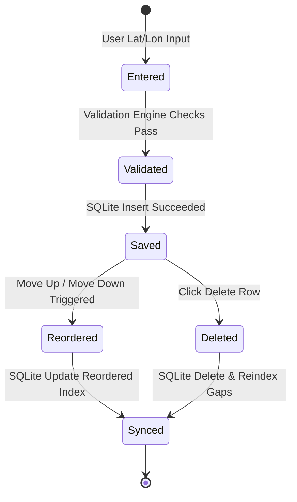
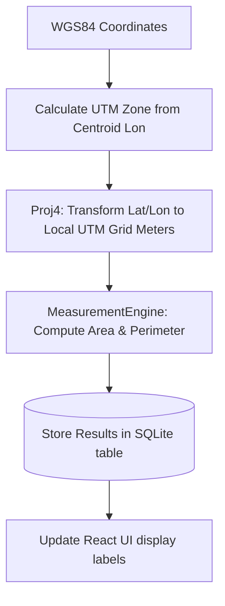
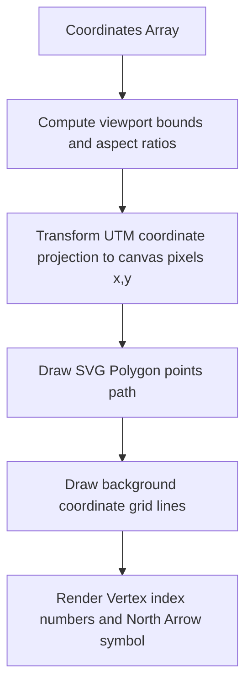
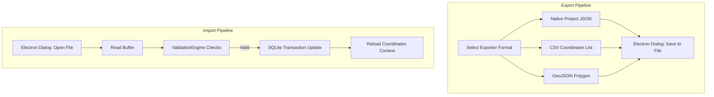
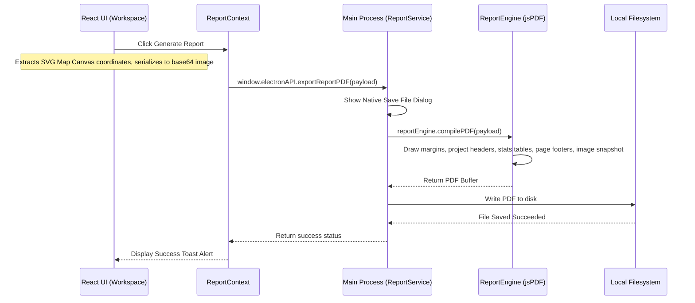

# Lifecycles & Pipelines Walkthrough

This document outlines the workflows, lifecycles, and backend processing pipelines of GeoTerrain Analyzer v1.0.0.

---

## 1. User Workflow

The end-to-end user workflow is structured as follows:

---

## 2. Project Lifecycle

Projects transition through the following states:

---

## 3. Coordinate Lifecycle

Each coordinate vertex transitions through states from creation to sync:

---

## 4. Measurement Pipeline

Geospatial calculations follow a rigorous UTM projection zone transformation pipeline:

---

## 5. Rendering Pipeline

The visualizer draws vector graphics onto the screen:

---

## 6. Import/Export Pipeline

Data exchange imports/exports follow serialization flows:

---

## 7. Report Generation Pipeline

Generates professional, print-ready summaries completely offline:

